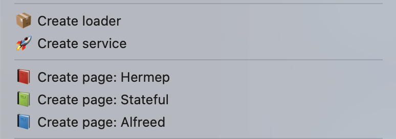

  

# Koby

The ultimate VSCode templating extension, create all your page, service, loader etc directly from VSCode in a few seconds 🚀 !

## 🧐 What is it ?

Easily create some Flutter page pre-filled like:
- MVVM [hermep](https://pub.dev/packages/hermep) page
- MVVM [alfreed](https://pub.dev/packages/alfreed) page
- MVVM vanilla stateful page
- Service
- Loader
  
More are coming next... 🤩

## 🎯 How it works ?

Just right click on the folder you want 💪

## 📸 How it looks ?

Here is the context menu (right click)

